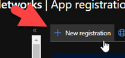
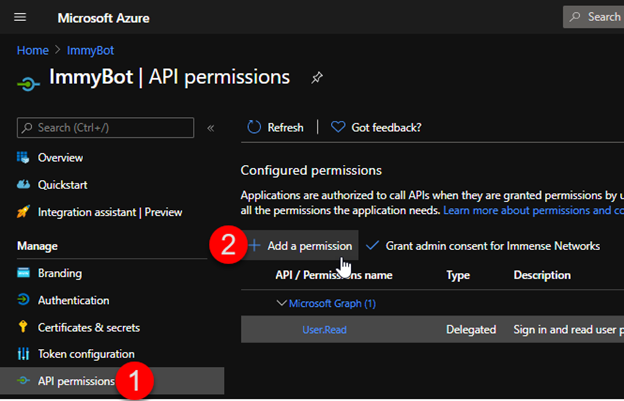
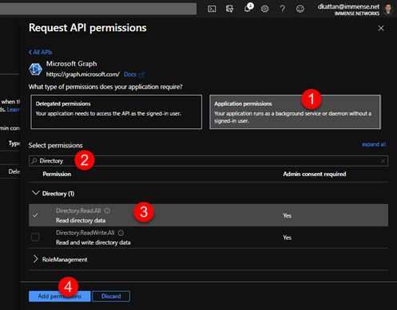
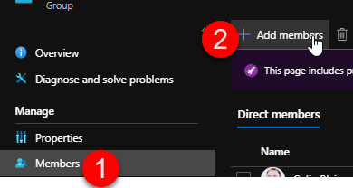
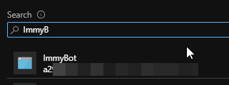

# AzureAD/365 Integration

Enabling this allows ImmyBot to
1. Sync all users from your partner tenant
2. Sync all users from your customer's tenants
3. Install the 365 applications a user is licensed for (Apps for business/Apps for entrprise/Project/Visio)
4. Deploy software to Teams, On-Premises Security Groups (Ex. Everyone in the Engineering Team gets AutoCAD 2022)

## 1. Create an App Registration

Navigate to: https://aad.portal.azure.com/

## 2. Grant Permissions

## 3. Create Client Secret

## 4. Add to Admin Agents Group

## 5. Copy the `Application (client) ID` and `Client Secret Value` into the form in ImmyBot.
