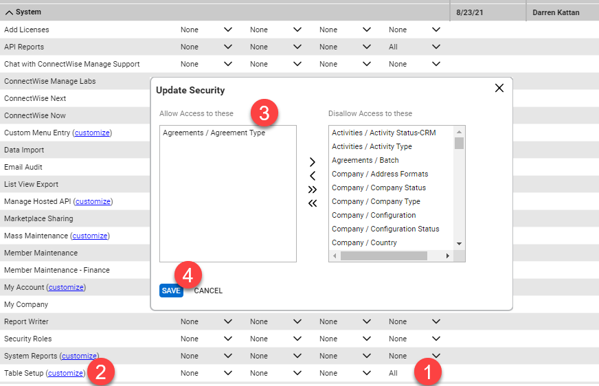

# ConnectWise Manage Integration

Setting up this integration allows you to
1. Deploy Software to machines covered by a certain agreement type 
  - Example: Deploy Huntress to all customers with a Managed Security Agreement
1. (Preferred) Deploy Software to machines covered by an Agreement with a specific Addition 
  - Example: Deploy SentinelOne to all computers that have SentinelOne as an Addition on their agreement

**If you use Automate, setup the Automate integration first and import your customers from there. Importing customers from Manage generally results in many unnecessary Tenants being created in ImmyBot. You can link Automate to Manage to leverage the existing mappings between Automate<->Manage instead of manually mapping your Manage customers**

## Create an ImmyBot Role with the following permissions

- *Company -> Company Maintenance -> Inquire Level (All)*
- *Finance -> Agreements -> Inquire Level (All)*
- *Procurement -> Product Catalog -> Inquire Level (All)*
- *Procurement -> Product -> Inquire Level (All)*
- *System -> API Reports -> Inquire Level (All)*

## Create an API Member

Go to *System -> Members* and create a new **API Member**

Create a new API key

## Plugin the API Keys in ImmyBot

Create a new PSA Link and fill in the **Provider Info**

