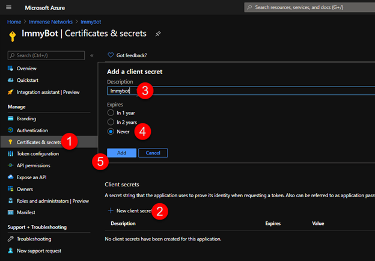
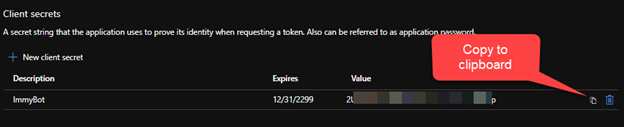

# CSP Preconsent Instructions

## 1. Create an App Registration

## 2. Grant Permissions

## 3. Create Client Secret

## 4. Add to Admin Agents Group

Copy the `Application (client) ID` and `Client Secret` into the form in ImmyBot.