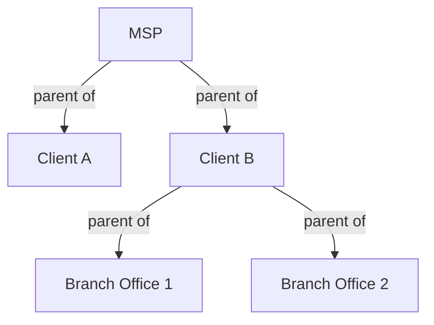

# Tenant Management

This guide explains how to effectively manage tenants (customers) in ImmyBot, including creation, organization, and configuration.

## Understanding Tenants

In ImmyBot, tenants represent the organizations you manage. Each tenant:

- Has its own set of computers and users
- Can have tenant-specific deployments
- May have different settings and configurations

Tenants can be organized hierarchically, with parent-child relationships that allow for inheritance of certain settings and deployments.

## Tenant Types

ImmyBot supports several tenant types:

### MSP Tenant

The MSP tenant is the top-level tenant in your ImmyBot instance. It represents your organization and serves as the parent for all client tenants.

### Client Tenants

Client tenants represent your customers. They can be created:
- Manually in ImmyBot
- Automatically through RMM integration
- Automatically through PSA integration
- Imported from Azure AD

### Sub-Tenants

Sub-tenants are child tenants of client tenants. They can represent:
- Branch offices
- Departments
- Divisions
- Geographic locations

## Creating Tenants

### Creating Tenants Manually

1. Navigate to **Tenants** in the left sidebar
2. Click the **New** button in the top-right corner
3. Enter the tenant information:
   - Name (required)
   - Slug (optional, used for URL identification)
   - Parent Tenant (optional, for hierarchical organization)
4. Click **Save**

### Importing Tenants from Integrations

If you have configured integrations, you can import tenants:

1. Navigate to **Integrations** in the left sidebar
2. Select your integration (RMM, PSA, or Azure)
3. Click **Sync**
4. Review the imported tenants
5. Configure any additional settings
6. Click **Save**

## Tenant Hierarchy

ImmyBot allows you to create a hierarchical structure of tenants:

### Creating Parent-Child Relationships

1. Navigate to **Tenants**
2. Select the child tenant
3. Click **Edit**
4. Select the parent tenant from the dropdown
5. Click **Save**

### Inheritance in Tenant Hierarchy

Child tenants inherit certain settings from their parents:

- Deployments (if configured for inheritance)
- Maintenance windows
- Default settings
- Integration mappings

You can override inherited settings at the child tenant level when needed.

## Tenant Settings

Each tenant can have its own settings:

### Configuring Tenant Settings

1. Navigate to **Tenants**
2. Select the tenant
3. Click **Settings**
4. Configure the available settings:
   - Maintenance windows
   - Default deployment options
   - Notification preferences
   - Custom fields
5. Click **Save**

### Tenant-Specific Deployments

You can create deployments that apply only to specific tenants:

1. Create a new deployment
2. Under **Targets**, select **Tenant**
3. Choose the specific tenant
4. Configure the deployment as needed
5. Save the deployment

## Managing Tenant Users

Each tenant can have its own set of users:

### Adding Users to Tenants

1. Navigate to **Tenants**
2. Select the tenant
3. Click **Users**
4. Click **Add User**
5. Enter user information or select from existing users
6. Assign appropriate roles
7. Click **Save**

### Importing Users from Azure AD

If you have configured Azure AD integration:

1. Navigate to **Integrations** > **Azure**
2. Select the tenant
3. Click **Sync Users**
4. Review the imported users
5. Configure any additional settings
6. Click **Save**

## Tenant Reporting

ImmyBot provides several reports for tenant management:

### Tenant Overview

1. Navigate to **Tenants**
2. Select the tenant
3. View the dashboard for an overview of:
   - Computer count and status
   - Recent maintenance sessions
   - Deployment compliance
   - Software inventory

### Tenant Compliance

1. Navigate to **Reports** > **Compliance**
2. Filter by tenant
3. View compliance status for all deployments
4. Identify non-compliant computers
5. Take action as needed

## Tenant Migration

Sometimes you may need to move computers between tenants:

### Moving Computers Between Tenants

1. Navigate to **Computers**
2. Select the computer(s) to move
3. Click **Reassign**
4. Select the new tenant
5. Click **Save**
6. Confirm the action

### Merging Tenants

To merge two tenants:

1. Identify the source and destination tenants
2. Move all computers from the source to the destination
3. Update any tenant-specific deployments
4. Once empty, you can delete the source tenant

## Best Practices

Follow these best practices for effective tenant management:

1. **Consistent Naming**: Use a consistent naming convention for tenants
2. **Hierarchical Organization**: Create a logical hierarchy that reflects your business relationships
3. **Regular Audits**: Periodically review tenant structure and settings
4. **Documentation**: Maintain documentation of tenant configurations
5. **Limit Direct Access**: Restrict direct access to the MSP tenant

## Next Steps

Now that you understand how to manage tenants in ImmyBot, you might want to explore:

- [User Roles and Security](./user-roles.md) - Learn about user permissions and security
- [Integration Overview](./integration-overview.md) - Connect ImmyBot to your existing tools
- [Maintenance and Updates](./maintenance-updates.md) - Configure maintenance for your tenants

---

**Next Steps:** [User Roles and Security →](./user-roles.md) | [Integration Overview →](./integration-overview.md)
