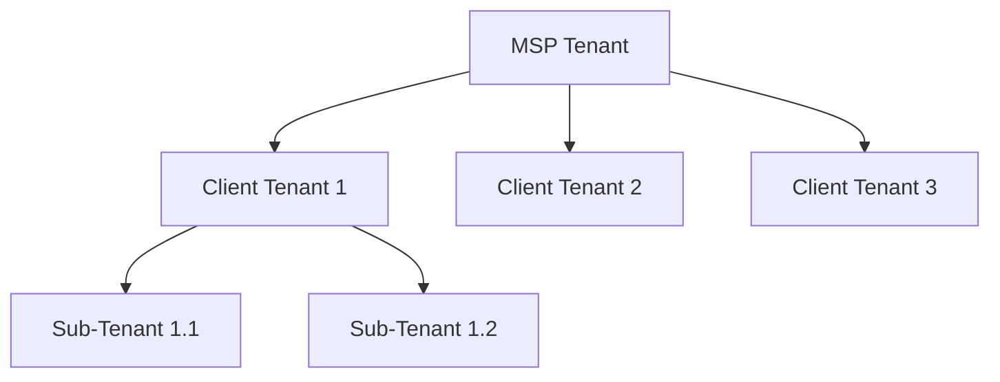

# Tenants

This guide explains how to manage tenant organizations in ImmyBot, allowing you to organize and control access to resources across multiple client environments.

## Understanding Tenants

In ImmyBot, tenants represent separate client organizations that you manage. The tenant system allows you to:

1. Organize computers and resources by client
2. Control access and permissions on a per-tenant basis
3. Configure tenant-specific settings and preferences
4. Create hierarchical relationships between tenants

## Creating Tenants

### Adding a New Tenant

1. Navigate to **Tenants** in the main navigation
2. Click the **New** button
3. Enter the required information:
   - **Name**: The display name for the tenant
   - **Slug**: A unique identifier used in URLs (optional)
   - **Parent Tenant**: Select a parent tenant to create a hierarchical relationship (optional)
4. Click **Save**

### Tenant Hierarchy

ImmyBot supports parent-child relationships between tenants, allowing you to create a hierarchical structure:

- **MSP Tenant**: The top-level tenant representing your organization
- **Client Tenants**: Tenants representing your clients
- **Sub-Tenants**: Divisions or departments within client organizations

When you create a hierarchical structure:
- Child tenants inherit certain settings from parent tenants
- Users with access to parent tenants can access child tenants
- Deployments can target specific levels in the hierarchy

## Managing Tenants

### Tenant Details

To view and edit tenant details:

1. Navigate to **Tenants**
2. Click on the tenant name
3. Use the tabs to access different aspects of the tenant:
   - **Overview**: Basic tenant information
   - **Settings**: Tenant-specific configuration
   - **Users**: User accounts associated with the tenant
   - **Computers**: Computers assigned to the tenant
   - **Deployments**: Deployments targeting the tenant

### Tenant Settings

Each tenant can have specific settings configured:

1. Navigate to **Tenants**
2. Click on the tenant name
3. Select the **Settings** tab
4. Configure options such as:
   - **Maintenance Windows**: When automated maintenance can run
   - **Default Deployment Settings**: Default options for new deployments
   - **Branding**: Custom branding for the tenant
   - **Integration Settings**: Tenant-specific integration configurations

### Tenant Tags

Tags help you organize and filter tenants:

1. Navigate to **Show more** > **Tags**
2. Create tags that represent meaningful categories
3. Assign tags to tenants by:
   - Editing individual tenants and selecting tags
   - Using batch actions to tag multiple tenants at once

## Batch Actions

ImmyBot allows you to perform actions on multiple tenants simultaneously:

1. Navigate to **Tenants**
2. Select multiple tenants using the checkboxes
3. Click **Batch Actions** to open the sidebar
4. Choose from available actions:
   - **Add Tags**: Apply tags to selected tenants
   - **Remove Tags**: Remove tags from selected tenants
   - **Set Parent Tenant**: Assign a parent tenant to selected tenants
   - **Delete Tenants**: Delete selected tenants (use with caution)

## Tenant Slugs

Slugs are unique identifiers used in URLs and references:

1. Navigate to **Tenants**
2. Click on a tenant name or edit directly in the grid
3. Set a unique slug in the **Slug** field
4. Click **Save**

Benefits of using slugs:
- More readable URLs
- Consistent references in scripts and automation
- Easier identification in logs and reports

## Access Control

Control who can access which tenants:

### User Permissions

1. Navigate to **Users**
2. Select a user
3. Configure tenant access:
   - **All Tenants**: User can access all tenants
   - **Specific Tenants**: User can only access selected tenants
   - **Role-Based Access**: Different permissions for different tenants

### Role-Based Access Control

Create roles with specific permissions:

1. Navigate to **Show more** > **Roles**
2. Create or edit a role
3. Configure tenant-specific permissions
4. Assign roles to users

## Tenant Deletion

To delete a tenant:

1. Navigate to **Tenants**
2. Select the tenant
3. Click **Delete**
4. Confirm the deletion

> **Warning**: Deleting a tenant will also delete all associated data, including computers, deployments, and settings. This action cannot be undone.

## Best Practices

Follow these best practices for effective tenant management:

1. **Consistent Naming**: Use a consistent naming convention for tenants
2. **Hierarchical Structure**: Utilize parent-child relationships for logical organization
3. **Tags for Filtering**: Use tags to create dynamic groupings of tenants
4. **Regular Audits**: Periodically review tenant access and permissions
5. **Documentation**: Maintain documentation of your tenant structure and policies

## Troubleshooting

### Common Issues

1. **Inheritance Problems**
   - Check parent-child relationships
   - Verify that inheritance is enabled for specific settings

2. **Access Issues**
   - Confirm user permissions for the tenant
   - Check role assignments and permissions

3. **Missing Computers**
   - Verify computer-tenant assignments
   - Check for filtering or search criteria that might hide computers

## Next Steps

Now that you understand how to manage tenants in ImmyBot, you might want to explore:

- [Computer Management](./managing-computers.md) - Learn how to manage computers within tenants
- [Deployments](./deployments.md) - Create and manage deployments targeting tenants
- [User Management](./user-management.md) - Configure user access and permissions

---

**Next Steps:** [Computer Management →](./managing-computers.md) | [Deployments →](./deployments.md)
