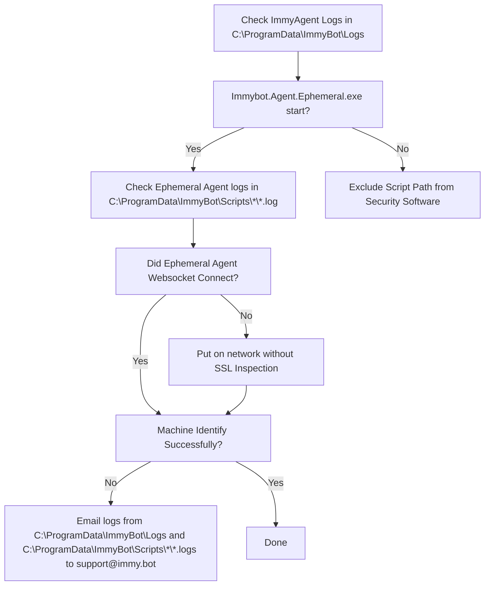
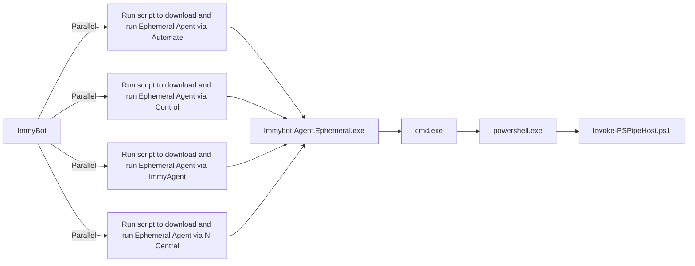

::: danger *ImmyBot will no longer support Windows 7, Server 2008 (or Server 2012 w/o [ESUs](https://learn.microsoft.com/en-us/windows-server/get-started/extended-security-updates-overview)) machines after May 14th, 2024*
.NET 7 support is ending May 14th, and as a result we will be transitioning the Agent to .NET 8 at that time period. We will not be offering support for these machines after May 14th.

Please see the [FAQ section for more details](https://docs.immy.bot/FAQ.html#what-windows-versions-does-immyagent-support)
:::

# Troubleshooting

## Identification Failures

### Needs a Manual Decision

Generally you will click "Agent Re-installed"

Often when an RMM Agent gets re-installed, it will get a new id in the RMM (ComputerId in Automate, SessionID in Control). ImmyBot will recognize that it is the same computer, but due to the fact that virtualization technologies and hard drive cloning can lead to the same scenario, we require you to tell us whether we should overwrite the existing RmmComputer, or keep both. 99% of the time you will click "Overwrite Existing". If the machine was in fact cloned, you would click Keep Both, in which case Immy shims the duplicate UUID with its own to prevent collisions.

## Pending Computers

Computers in the pending status have yet to be identified.

Computers may get stuck here if we are unable to run our Ephemeral Agent



Top 3 reasons for Identification Failures

1. SSL Inspection blocking our websocket
1. Security Software blocking PowerShell
1. Incorrect time is preventing SSL/TLS connection

To understand the various reasons identification can fail, it helps to understand how ImmyBot executions PowerShell

1. RMM or ImmyAgent runs Immybot.Agent.Ephemeral.exe
1. Immybot.Agent.Ephemeral.exe establishes a secure websocket to wss://subdomain.immy.bot and runs Invoke-PSPipeHost.ps1
1. Immybot.Agent.Ephemeral.exe feeds Invoke-PSPipeHost.ps1 PowerShell over a pipe from the websocket session



The most common cause of identification failure is security software.

To know if this is the case, pull the logs from C:\ProgramData\ImmyBotAgentService\*.log


Normal Immybot Agent logs look like this:

```
2022-06-14 00:02:25.560 -05:00 [DBG] Hosting starting
2022-06-14 00:02:25.799 -05:00 [INF] Starting Immybot Agent
2022-06-14 00:02:25.943 -05:00 [INF] Using configuration file stored at: C:\ProgramData\ImmyBotAgentService\config.json
2022-06-14 00:02:26.875 -05:00 [DBG] Initializing IoT Hub connection
2022-06-14 00:02:35.023 -05:00 [INF] Application started. Hosting environment: Production; Content root path: C:\WINDOWS\TEMP\.net\Immybot.Agent.Service\lreaszzz.wwx\
2022-06-14 00:02:35.024 -05:00 [DBG] Hosting started
2022-06-14 00:02:40.552 -05:00 [WRN] IoT Hub connection status Changed Status => [Connected] Reason => [Connection_Ok]
2022-06-14 02:06:32.159 -05:00 [DBG] Process started; ID: 12724
2022-06-14 02:06:37.358 -05:00 [DBG] Running C:\ProgramData\ImmyBot\Scripts\840290f2bd2142e2bd2c612542436763\Immybot.Agent.Ephemeral.exe --ImmyScriptPath C:\ProgramData\ImmyBot\Scripts\840290f2bd2142e2bd2c612542436763 --BackendAddress wss://immense.immy.bot/ --SessionID c946e1d1-f5fd-d36d-0489-d2a9ad9084e0
2022-06-14 02:06:38.335 -05:00 [DBG] PID 16184 <----- Indicates successful execution
2022-06-14 02:06:38.372 -05:00 [DBG] Process exited; Code: 0
```

Windows Defender will make the logs look like this:

```
2022-11-17 13:13:36.604 +11:00 [DBG] Hosting starting
2022-11-17 13:13:36.817 +11:00 [INF] Starting Immybot Agent
2022-11-17 13:13:36.840 +11:00 [INF] Using configuration file stored at: C:\ProgramData\ImmyBotAgentService\config.json
2022-11-17 13:13:37.590 +11:00 [DBG] Initializing IoT Hub connection
2022-11-17 13:13:37.860 +11:00 [DBG] Hosting started
2022-11-17 13:13:38.598 +11:00 [WRN] IoT Hub connection status Changed Status => [Connected] Reason => [Connection_Ok]
2022-11-17 13:13:39.157 +11:00 [WRN] Dirty-Shutdown detected! Dirty-File created at: "2022-11-07T04:11:59.3975026Z" UTC
2022-11-17 13:13:41.686 +11:00 [DBG] Process started; ID: 5660
2022-11-17 13:13:44.674 +11:00 [DBG] Running C:\ProgramData\ImmyBot\Scripts\4303da9b790b41c6978b50b872fe17cb\Immybot.Agent.Ephemeral.exe --ImmyScriptPath C:\ProgramData\ImmyBot\Scripts\4303da9b790b41c6978b50b872fe17cb --BackendAddress wss://ericom.immy.bot/ --SessionID a92c0ed1-ea3b-7f8a-d9c6-946d9b44ccc5
2022-11-17 13:13:49.577 +11:00 [DBG] WMI Error 2
```

DNS Filtering/Issues make the logs look like this

```
2022-09-20 20:39:59.712 +10:00 [INF] RESPONSE: {
  "Resource": "installer/challenge/request",
  "Method": "POST",
  "StatusCode": 0,
  "ErrorException": {
    "ClassName": "System.Net.WebException",
    "Message": "No such host is known. (XXXX.immy.bot:443)"
```

To correct it, you need to exclude DNS filtering for your instances hostnames, which are found under
 Show more > integrations > Fetch IP Address and Hostnames

If Powershell is failing to start on the endpoint within 60 seconds a timeout will occur.

Here is a suggestion on a cause and possible fix for that one <https://www.reddit.com/r/PowerShell/comments/rx68fw/powershell_slow_to_open_long_load_timesfixed>

## Security Software Exclusions

Ideally you would instruct your security software would support excluding code signed by

```
CN=Immense Networks LLC, O=Immense Networks, L=Baton Rouge, S=Louisiana, C=US
```

Exclusions based on code signing certificate are an industry standard feature and should be a standard feature in any best-in-class security software. However, if your security software is unable to exclude based on code signing certificate, create an exclusion for your instance's Script Path.

Your script path can be found under Settings->Preferences->Script Path


* [ThreatLocker](#threatlocker)
* [Sophos Central](#sophoscentral)
* [BitDefender](#bitdefender)
* [CrowdStrike](#CrowdStrike)
* [Microsoft Defender for Endpoint](#microsoft-defender-for-endpoint)
* [Cylance](#Cylance)
* [SentinelOne](#SentinelOne)
* [DNSFilter](#DNSFilter)

### ThreatLocker

1. Application Control-> Applications
2. Create New Application
3. Put the following value into Certificate and click Add

```
CN=Immense Networks LLC, O=Immense Networks, L=Baton Rouge, S=Louisiana, C=US
```

4. Add your instance’s [script path](#script-path-exclusion)

Ultimately it should look like this:

5. Create a New Application Policy
 

### Sophos Central

**Tenant Specific**
Manual Addition:

1. Launch Client Shell
2. Navigate to Global Settings - Allowed Applications
3. Select "Add apps"
4. In the "allow by:" dropdown, select certificate and add the following

```
CN=Immense Networks LLC, O=Immense Networks, L=Baton Rouge, S=Louisiana, C=US
```

Event Log Method:
If Sophos reports that Immy Bot has been blocked, you have the option of going to the Event Log and and select the option to allow by Certificate. This will only work if Sophos has picked up an alert for a process signed by the Immy Bot code signing certificate

**Partner Global Templates**

1. Navigate to Settings & Policies - Global Templates and select the template you would like to modify
2. Once in the template, navigate to Global Settings - Allowed Applications
3. Follow steps 3 and 4 listed in the **Tenant Specific** section above

### BitDefender

BitDefender will intermittently block script execution unless you disable Aggressive scanning mode or add a your instance's [Script Path](#security-software-exclusions) to your policy's exclusion list.

### CrowdStrike

CrowdStrike uses AI to decide what to allow and disallow. Periodically this AI will mark the ImmyBot Agent or ImmyBot Ephemeral Agent as malicious. This usually happens after we update it. Marking it as a false positive in your CrowdStrike portal will train the global AI to not treat it as malicious.

### Microsoft Defender for Endpoint

Add a your instance's [Script Path](#security-software-exclusions) to your policy's exclusion list.
<https://docs.microsoft.com/en-us/mem/intune/configuration/device-restrictions-configure#create-the-profile>

### Cylance

Cylance blocks our websocket making the ImmybotAgent log look like this:

```
2022-09-21 12:24:26.562 -04:00 [INF] Process exiting.
2022-09-21 12:24:40.106 -04:00 [DBG] Closing Websocket...
2022-09-21 12:24:49.743 -04:00 [INF] Marked ConnectionState as disconnected.
2022-09-21 12:24:50.171 -04:00 [ERR] Application shutting down (App lifetime token cancelled)
System.IO.IOException: Cannot access a closed stream.
at System.Net.Http.HttpConnection.RawConnectionStream.WriteAsync(ReadOnlyMemory`1 buffer, CancellationToken cancellationToken)
```

To correct it, you need to bypass SSL Inspection for your instances hostnames/IPs, which are found under
 Show more > integrations > Fetch IP Address and Hostnames

### SentinelOne

 Sentinel requires BOTH your instance's Script path and the ImmyBot Agent process excluded. With only the script path excluded, devices will regularly have issues running the ImmyBot Agent to download the ephemeral agent. This is apparent in two cases:
  1. Importing devices - The new agent can't download the ephemeral agent to start running inventory.
   2. Updating ImmyBot Agents - The new agent can't download the corresponding new ephemeral agent when attempting to run deployments or scripts.

You can also set your Exclusion Mode to "Interoperability - Extended".

### DNSFilter

There has been reports that DNSFilter (and possibly other DNS Filtering tools) while not directly blocking subdomain.immy.bot, has been failing to resolve some DNS.
In the case of DNSFilter it was confirmed that it was not blocking ImmyBot, but was not resolving DNS so connection attempted to the backend were failing.
Expliclty allowing the DNS subdomain.immy.bot (replace subdomain with your ImmyBot instance subdomain) was confirmed to resolve the resolution failing
https://help.dnsfilter.com/hc/en-us/articles/1500008111381-Allow-and-Block-Lists

### Group Policy Objects

Computer Configuration | Policies | Administrative Templates | Windows Components | Windows PowerShell | Turn on Script Execution (Enabled)

User Configuration | Policies | Administrative Templates | Windows Components | Windows PowerShell | Turn on Script Execution (Enabled)

These GPOs have been known to cause issues with running scripts.
