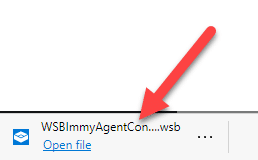

# Testing with Windows Sandbox

Windows Sandbox provides an ideal environment for testing ImmyBot deployments and configurations in a safe, isolated container. This guide explains how to set up and use Windows Sandbox with ImmyBot.

## What is Windows Sandbox?

Windows Sandbox is a lightweight desktop environment that:
- Creates a temporary, disposable instance of Windows
- Resets completely when closed, leaving no persistent state
- Provides isolation from your host system
- Starts up quickly and is optimized for testing

This makes it perfect for testing ImmyBot deployments without affecting your production environment.

## Prerequisites

- Windows 10 Pro, Enterprise, or Education (version 1903 or later)
- Virtualization capabilities enabled in BIOS/UEFI
- At least 4GB of RAM (8GB recommended)
- At least 1GB of free disk space

## Enabling Windows Sandbox

If you haven't used Windows Sandbox before, you need to enable it first:

1. Open Windows PowerShell as Administrator
2. Run the following command:

```powershell
Enable-WindowsOptionalFeature -FeatureName "Containers-DisposableClientVM" -All -Online -NoRestart
```

3. Restart your computer if prompted

Alternatively, you can enable it through Windows Features:
1. Open Control Panel > Programs > Turn Windows features on or off
2. Check the box for "Windows Sandbox"
3. Click OK and restart if prompted

## Testing ImmyBot in Windows Sandbox

### Step 1: Download the Windows Sandbox Configuration File

From the ImmyBot dashboard, download the Windows Sandbox configuration file (.wsb):


### Step 2: Launch the Sandbox Environment

Double-click the downloaded .wsb file to launch Windows Sandbox:



### Step 3: Wait for ImmyBot Agent Installation

The ImmyBot Agent will automatically install in the Sandbox environment:


### Step 4: Onboard the Sandbox Computer

Once the agent is installed, the computer will appear in ImmyBot. [Onboard](./onboarding.md) the Sandbox computer:


### Step 5: Assign Customer and User

Select the appropriate customer and user for testing:


### Step 6: Start the Onboarding Process

Begin the onboarding process to apply your deployments:


This will create an "Onboarding" maintenance session that will apply all applicable deployments to the Sandbox environment.

## Limitations of Windows Sandbox

When testing with Windows Sandbox, be aware of these limitations:

- **No Persistence**: All changes are lost when the Sandbox is closed
- **Driver Limitations**: Software that requires drivers may not work properly
- **Restart Limitations**: Processes requiring restarts may not complete correctly
- **Performance**: Resource-intensive applications may run slower than on a physical machine
- **Network Isolation**: Some network-dependent features may behave differently

## Best Practices for Testing

1. **Test One Thing at a Time**: Focus on testing a single deployment or configuration
2. **Document Your Tests**: Keep notes on what works and what doesn't
3. **Compare with Physical Machines**: Verify critical deployments on physical machines after testing in Sandbox
4. **Use for Initial Validation**: Sandbox is great for initial testing but may not catch all edge cases

## Next Steps

After testing in Windows Sandbox, you might want to:

- [Create custom deployments](./creating-deployments.md) based on your test results
- [Configure maintenance schedules](./maintenance-updates.md) for your production environment
- [Review common issues](./common-issues.md) that might affect your deployments

---

**Next Steps:** [Creating Deployments →](./creating-deployments.md) | [Troubleshooting →](./troubleshooting.md)
